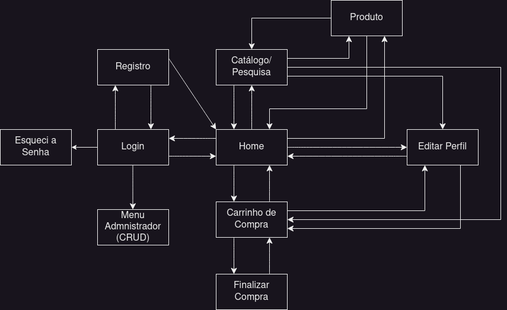

# Project Report
## Grupo 14
Membros:  
- Gabriel Barbosa de Amorim Perão - NUSP: 12677874
- Murillo Moraes Martins - NUSP: 12701599
- Thaís Ribeiro Lauriano - NUSP: 12542518

## Requirements
Além dos requisitos descritos no documento original, temos os seguintes requisitos específicos para o nosso projeto:
- Funcionalidade Específica: nosso site irá possuir um sistema de previews de músicas, isso será mais detalhado na próxima seção.

## Project Description
Nosso projeto é uma loja online de discos de vinil, chamada "Vinil Mil", nela os usuários podem comprar discos de vinil com músicas de diversos gêneros.  
  
Para cumprir os requisitos, a loja terá dois tipos de usuários: Administradores e Clientes. Os Administradores podem adicionar, editar e remover informações sobre os discos disponíveis na loja. Enquanto os usuários poderão fazer compras de um ou mais discos.  
  
Para a funcionalidade específica do nosso projeto, cada disco terá uma _preview_ de uma música contida naquele disco, ou seja, o cliente poderá ouvir uma parte do album sem precisar comprá-lo, assim o cliente pode ter uma ideia melhor do produto disponível na loja. 
  
Para exemplificar ainda mais como o site será, abaixo está um diagrama de navegação demonstrando como as páginas podem ser navegadas:



No caso a maior parte dessas páginas irá ser navegada pelo Cliente, enquando um Administrator só irá ter acesso à um Menu em que ele pode fazer alterações aos produtos da loja.

## Comments About the Code
Sem comentários

## Test Plan
Para a parte do frontend (ou funcionalidade do cliente) não foram utilizadas ferramentas de teste. Ao invés disso foram feitos testes visuais para saber se os componentes estavam sendo renderizados corretamente ou se os containers estavam se comportando da forma esperada de acordo com o uso deles na aplicação.

## Test Results
Para a parte do frontend foram utilizados testes visuais (como dito na seção anterior), portanto não é possivel mostrar o resultado dos testes (além de ver a funcionalidade dos componentes na aplicação).

## Build Procedures
O projeto foi desenvolvido usando a biblioteca React, para utilizar o projeto é necessário primeiro instalar o npm usando o comando:
```
$ sudo apt install npm
```
Com o npm instalado, é necessário acessar a pasta do projeto com o comando:
```
$ cd vinil_mil/
```
Após isso é necessário instalar as dependências da aplicação (que pode demorar um tempo):
```
$ npm install
```
A partir disso é só iniciar o projeto usando o comando:
```
$ npm start
```
Depois de um tempo será aberto uma janela no browser com a apĺicação.

### Usuários:
email: admin  
senha: admin

email: gabrielperao@hotmail.com  
senha: senha

## Problems
Sem problemas

## Comments
Sem comentários
